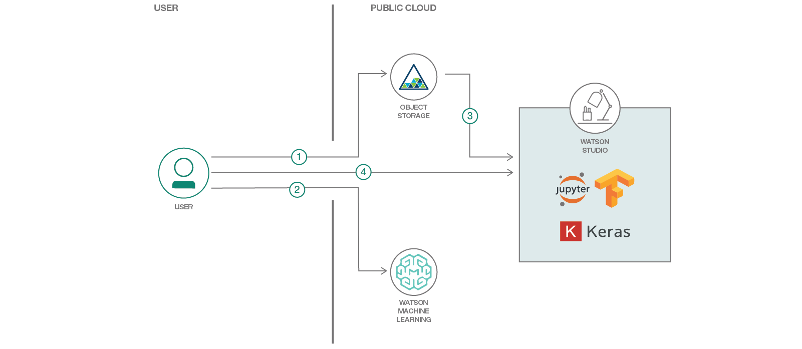
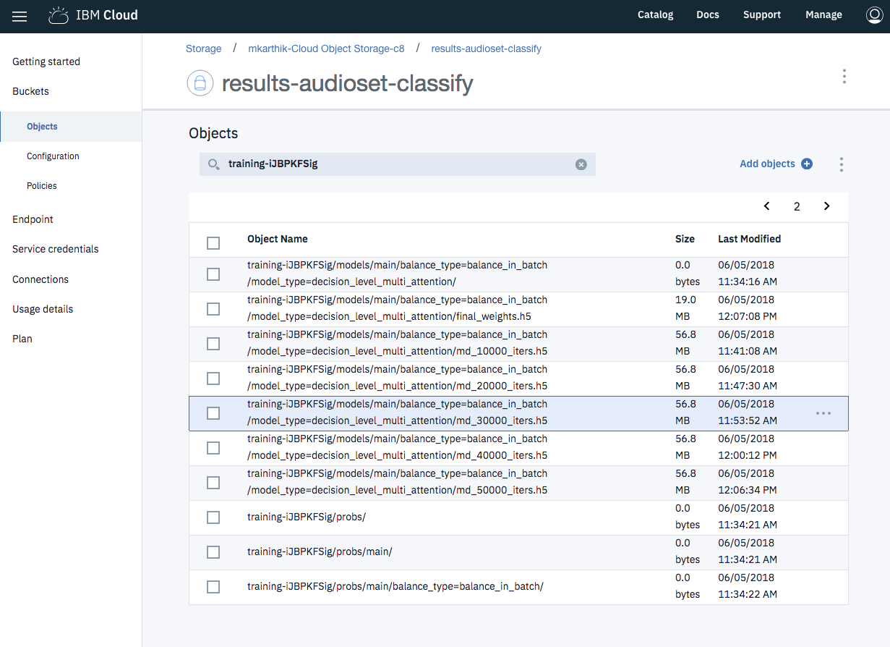

# Train and Evaluate an Audio Classifier using Keras and Jupyter Notebook

This developer code pattern will guide you through training a Deep Learning model to classify audio embeddings on IBM's Deep Learning as a Service (DLaaS) platform  - Watson Machine Learning - and performing inference/evaluation on IBM Watson Studio. 

The model will use audio embeddings generated by the VGG-ish [model](https://github.com/tensorflow/models/tree/master/research/audioset) as an input and generate output probabilities/scores for 527 classes. For the purposes of illustrating the concept and exposing a developer to the features on IBM Cloud platforms, Google's Audioset data is used, where the embeddings have been pre-processed and available readily.  However, a developer can leverage this model to create their own custom audio classifier trained on their own audio embeddings/data.

When the reader has completed this Code Pattern, they will understand how to:

* Setup an IBM Cloud object storage bucket and upload the training data to the cloud.
* Upload a Deep Learning model to Watson ML for training.
* Integrate the object storage buckets into IBM Watson Studio.
* Perform inference on an evaluation dataset using Jupyter Notebooks over IBM Watson Studio.




## Flow
1. Upload training files to Object Storage.
2. Train on Watson Machine Learning.
3. Transfer trained model weights to new bucket on IBM Cloud and link it to IBM Watson Studio.
4. Upload and run the attaheched Jupyter notebook on Watson Studio to perform inference. 

## Included Components
* [IBM Cloud Object Storage](https://www.ibm.com/cloud/):  A highly scalable cloud storage service, designed for high durability, resiliency and security.
* [IBM Cloud Watson Machine Learning](https://www.ibm.com/cloud/machine-learning/pricing): Create, train, and deploy self-learning models. 
* [Watson Studio](https://www.ibm.com/cloud/watson-studio): Build, train, deploy and manage AI models, and prepare and analyze data, in a single, integrated environment.
* [Jupyter Notebooks](http://jupyter.org/): An open source web application that allows you to create and share documents that contain live code, equations, visualizations, and explanatory text.
* [Keras](https://keras.io/): The Python Deep Learning library.
* [Tensorflow](https://www.tensorflow.org/): An open-source software library for Machine Intelligence.

## Featured Technologies

* [Cloud](https://www.ibm.com/developerworks/learn/cloud/): Accessing computer and information technology resources through the Internet.
* [Data Science](https://medium.com/ibm-data-science-experience/): Systems and scientific methods to analyze structured and unstructured data in order to extract knowledge and insights.
* [Artificial Intelligence](https://www.ibm.com/developerworks/learn/cognitive/index.html):Artificial intelligence can be applied to disparate solution spaces to deliver disruptive technologies.
* [Python](https://www.python.org/): Python is a programming language that lets you work more quickly and integrate your systems more effectively.

# Prerequisites

1. Setup cloud object storage and AWS command line tools.
2. Create accounts on IBM Cloud and Watson Studio.


### Setup an IBM Cloud Object Storage (COS) account
- Create an IBM Cloud Object Storage account if you don't have one (https://www.ibm.com/cloud/storage)
- Create credentials for either reading and writing or just reading
	- From the bluemix console page (https://console.bluemix.net/dashboard/apps/), choose `Cloud Object Storage`
	- On the left side, click the `service credentials`
	- Click on the `new credentials` button to create new credentials
	- In the `Add New Credentials` popup, use this parameter `{"HMAC":true}` in the `Add Inline Configuration...`
	- When you create the credentials, copy the `access_key_id` and `secret_access_key` values.
	- Make a note of the endpoint url
		- On the left side of the window, click on `Endpoint`
		- Copy the relevant public or private endpoint. [I choose the us-geo private endpoint].
- In addition setup your [AWS S3 command line](https://aws.amazon.com/cli/) which can be used to create buckets and/or add files to COS.
   - Export `AWS_ACCESS_KEY_ID` with your COS `access_key_id` and `AWS_SECRET_ACCESS_KEY` with your COS `secret_access_key`

### Setup IBM CLI & ML CLI

- Install [IBM Cloud CLI](https://console.bluemix.net/docs/cli/reference/bluemix_cli/get_started.html#getting-started)
  - Login using `bx login` or `bx login --sso` if within IBM
- Install [ML CLI Plugin](https://dataplatform.ibm.com/docs/content/analyze-data/ml_dlaas_environment.html)
  - After install, check if there is any plugins that need update
    - `bx plugin update`
  - Make sure to setup the various environment variables correctly:
    - `ML_INSTANCE`, `ML_USERNAME`, `ML_PASSWORD`, `ML_ENV`

# Steps

The steps can be broadly classified into the following topics:

1. Clone the repository.
2. Upload training data to cloud object storage.
3. Setup and upload model on Watson ML (DLaaS) to train.
4. Upload evaluation notebook to Watson Studio.
5. Run evaluation on Watson Studio.

Note: If you want to perform inference with pre-trained weights, skip to step 4 directly. 

## 1. Clone the repository

Clone this repository and change into the new directory:

```
$ git clone https://github.com/IBM/audioset-classification
$ cd audioset-classification
```

A few things to mention about the contents of the repository:

* [audio_classify.zip](audioset_classify.zip): This is the core training code we will be running on IBM Cloud. 
* [audioset_classify](audioset_classify/): The training code for reference. We will use the first .zip file to upload this code to the cloud.
* [training-runs.yml](training-runs.yml) This file is required to perform the training on IBM cloud. It is used to setup training metdata and connection information.
* [audioclassify_inference.ipynb](audioclassify_inference.ipynb) This is the notebook we will be using to perform inference after training. 

## 2. Upload training data to the cloud

* Download the data from [here](http://max-assets.s3-api.us-geo.objectstorage.softlayer.net/mnist_sequence1_sample_5distortions5x5.npz).

Alternatively the file can also be downloaded by running this command on the terminal. 
```
$ curl -O http://max-assets.s3-api.us-geo.objectstorage.softlayer.net/bal_train.h5

$ curl -O http://max-assets.s3-api.us-geo.objectstorage.softlayer.net/unbal_train.h5

$ curl -O http://max-assets.s3-api.us-geo.objectstorage.softlayer.net/eval.h5

```

* Create buckets on the object storage. This can be done either through the UI or through the command line as shown below. 

We will create one bucket to put the training data and one bucket where the code will save the results/models at the end of training. 

```
$ aws s3 mb s3://training-audioset-classify

$ aws s3 mb s3://results-audioset-classify

```
Note: Developers within IBM will need to add an endpoint URL to all `aws s3` comamnds. The above commands will thus look like this : 

```
$ aws --endpoint-url=http://s3-api.us-geo.objectstorage.softlayer.net s3 mb s3://training-audioset-classify

$ aws --endpoint-url=http://s3-api.us-geo.objectstorage.softlayer.net s3mb s3://results-audioset-classify

```

Now we can move the files to the object storage.
```
$ aws s3 cp bal_train.h5 s3://training-audioset-classify/
$ aws s3 cp unbal_train.h5 s3://training-audioset-classify/
$ aws s3 cp eval.h5 s3://training-audioset-classify/
```

## 3. Setup and upload model to Watson ML 

Now that we have our training data setup, we upload our model and submit a training job. 

* Replace the `api_key_id` and `secret_api_key_id` fields in the [training-runs.yml](training-runs.yml) file with your credentials as mentioned in the pre-requisites step.

* Run the below code on the terminal to start training
```
$ bx ml train audioset_classify.zip training-runs.yml
```

After the train is started, it should print the training-id that is going to be necessary for steps below

```
Starting to train ...
OK
Model-ID is 'training-GCtN_YRig'
```

### Monitor the  training run

- To list the training runs - `bx ml list training-runs`
- To monitor a specific training run - `bx ml show training-runs <training-id>`
- To monitor the output (stdout) from the training run - `bx ml monitor training-runs <training-id>`
	- This will print the first couple of lines, and may time out.

Once the training is complete, you can access the model and weights from the cloud object storage. The weights can be downloaded from the UI. 

The file we will be using for the next steps will be called `final_weights.h5`. It can be found on the object storage bucket `results-audioset-classify` under `<your_training_id>/models/main/balance_type=balance_in_batch/model_type=decision_level_multi_attention/final_weights.h5`. 


> The above screenshot shows the final weights/model checkpoints saved during training. 

The file can be downloaded via UI or via command line using the below command:

```
$ aws s3 cp s3://results-audioset-classify/<your_training_id>/models/main/balance_type=balance_in_batch/model_type=decision_level_multi_attention/final_weights.h5 final_weights.h5

```

## 4. Upload evaluation notebook on Watson Studio

1. Create a new project `Audioset Classification` on Watson Studio.
2. Navigate to `Assets -> Notebooks` and click on `New notebook`.
3. On the next screen click on `From file` and upload the [audioclassify_inference.ipynb](audioclassify_inference.ipynb) file. 
4. Upload `final_weights.h5` (file which we downloaded in the previous step) and `eval.h5` to the object storage linked to Watson Studio. This can be done by navigating to to `assets->New data asset` or clicking on the icon on the right to popup the data upload GUI as shown in the screenshot below. 


5. Similarly, upload [audioset_classify/metadata/eval_segments.csv](audioset_classify/metadata/eval_segments.csv) and [audioset_classify/metadata/class_label_indices.csv](audioset_classify/metadata/class_label_indices.csv) files. These files contain metadata such as YouTube URLs, class labels and start/end times. 

## Run inference

Now that all the data has been setup, you can open the uploaded Jupyter notebook and follow inline comments / directions. 
The first section loads the data into memory where applicable. Each cell mentions any action to be performed prior to executing the cell if applicable. 
Example: to load the credentials for the data, navigate to the `Files` section on the right and click on the required file and click on `Insert to code->Insert credentials`. This will insert a code snippet with required credentials/API keys.  


> Screenshot showing how to insert file credentials into the notebook.

* Run all cells as-is unless stated otherwise on cell comments. 

* We now demonstrate two cool applications at the end of this tutorial. 

### Real Time Demo

The Real Time Demo section takes in a random audio (given as a number which is referenced from the eval.h5 list) and performs real time inference on that embedding and outputs class labels and a YouTube embedding plays the corresponding video/audio snippet. You can try out different videos and see that the performance matches human level annotation. 
For example setting `video_number = 350` the top 5 class predictions are as shown in the screenshot below and it matches the audio perfectly. 


### Reverse search Audio using keywords

Now we perform inference on the entire eval set and generate top 5 class predictions for each evaluation example. We then use these to retrieve suggestions when queried for a particular keyword. A example of this is shown below where the keyword is 'Car' and we see that results are pretty accurate. 
Feel free to replace the `search_query = 'Car'` with your own keyword. For a list of all support keywords, refer to [class_labels_indices.csv](audioset_classify/metadata/class_labels_indices.csv).


## References
[1] Gemmeke, Jort F., et al. "Audio set: An ontology and human-labeled dataset for audio events." Acoustics, Speech and Signal Processing (ICASSP), 2017 IEEE International Conference on. IEEE, 2017.

[2] Kong, Qiuqiang, et al. "Audio Set classification with attention model: A probabilistic perspective." arXiv preprint arXiv:1711.00927 (2017).

[3] Yu, Changsong, et al. "Multi-level Attention Model for Weakly Supervised Audio Classification." arXiv preprint arXiv:1803.02353 (2018).

## External links
The core model for audio classification is based on the [implementation](https://github.com/qiuqiangkong/audioset_classification) and paper by  Qiuqiang Kong. 

The original [implementation](https://github.com/ChangsongYu/Eusipco2018_Google_AudioSet) of [3] is created by Changsong Yu. 


# Learn more

* **Artificial Intelligence Code Patterns**: Enjoyed this Code Pattern? Check out our other [AI Code Patterns](https://developer.ibm.com/code/technologies/artificial-intelligence/).
* **AI and Data Code Pattern Playlist**: Bookmark our [playlist](https://www.youtube.com/playlist?list=PLzUbsvIyrNfknNewObx5N7uGZ5FKH0Fde) with all of our Code Pattern videos
* **With Watson**: Want to take your Watson app to the next level? Looking to utilize Watson Brand assets? [Join the With Watson program](https://www.ibm.com/watson/with-watson/) to leverage exclusive brand, marketing, and tech resources to amplify and accelerate your Watson embedded commercial solution.

# License

[Apache 2.0](LICENSE)

